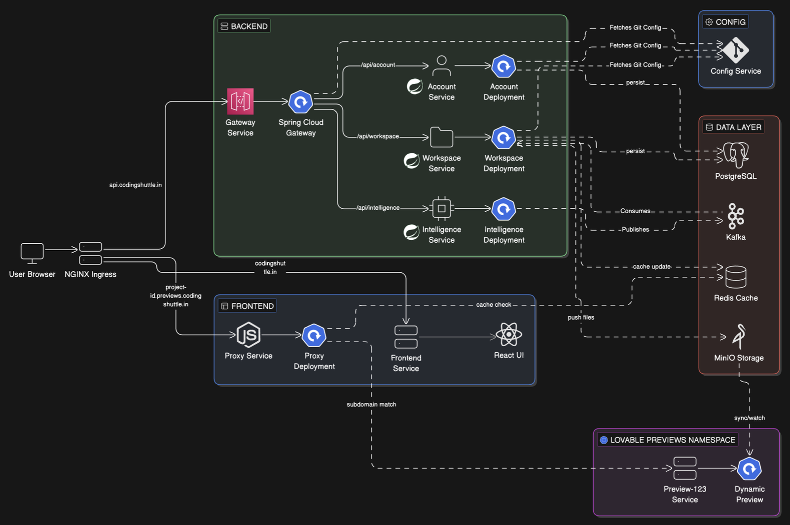

# Distributed Lovable Backend

This guide walks you through deploying the entire distributed-lovable backend to a single Google Kubernetes Engine (GKE) cluster.

## Table of Contents

- [Architecture Overview](#architecture-overview)
- [Prerequisites](#prerequisites)
- [Kubernetes Configuration Structure](#kubernetes-configuration-structure)
- [Step 1: Connect to GKE Cluster](#step-1-connect-to-gke-cluster)
- [Step 2: Create Namespaces and ConfigMap](#step-2-create-namespaces-and-configmap)
- [Step 3: Configure Secrets](#step-3-configure-secrets)
- [Step 4: Deploy Stateful Infrastructure](#step-4-deploy-stateful-infrastructure)
- [Step 5: Deploy Config Service](#step-5-deploy-config-service)
- [Step 6: Deploy Backend Microservices](#step-6-deploy-backend-microservices)
- [Step 7: Deploy Proxy Service](#step-7-deploy-proxy-service)
- [Step 8: Deploy Frontend](#step-8-deploy-frontend)
- [Step 9: Install NGINX Ingress Controller](#step-9-install-nginx-ingress-controller)
- [Step 10: Configure Ingress Routes](#step-10-configure-ingress-routes)
- [Step 11: Apply Network Policies](#step-11-apply-network-policies-optional-but-recommended)
- [Verification and Testing](#verification-and-testing)
- [CI/CD Pipeline Setup](#cicd-pipeline-setup)
- [Troubleshooting](#troubleshooting)
- [Quick Reference](#quick-reference-deployment-command-summary)

## Architecture Overview

The distributed-lovable platform is a microservices-based architecture running on Kubernetes (GKE). It follows a modern cloud-native design with service discovery, centralized configuration, API gateway pattern, and event-driven communication.

### System Architecture Diagram



The diagram above illustrates:
- **User Flow**: Requests come through NGINX Ingress → API Gateway → Backend Services
- **Service Communication**: Microservices communicate via Feign clients with JWT propagation
- **Data Layer**: PostgreSQL with pgvector for vector embeddings, Redis for caching, Kafka for events
- **Storage**: MinIO for object storage (file uploads)
- **Configuration**: Centralized config from Git repository via Config Service
- **Preview System**: Dynamic Kubernetes pods in `lovable-previews` namespace

### Microservices Overview

The platform consists of 7 microservices:

| Microservice | Port | Database/Storage | Key Integrations | Cross-Service Calls |
|--------------|------|------------------|------------------|---------------------|
| **Account Service** | 9050 | PostgreSQL (account_db) | Stripe API | None (base service) |
| **Workspace Service** | 9020 | PostgreSQL (workspace_db), MinIO | Kubernetes API, Redis | → Account Service (check limits, users) |
| **Intelligence Service** | 9030 | PostgreSQL (intelligence_db) | OpenAI (Spring AI) | → Workspace Service (read files)<br>→ Account Service (check AI limits) |
| **Config Service** | 8888 | Git Repository | GitHub API | None (infrastructure service) |
| **API Gateway** | 8080 | None | JWT validation | Routes to all services |
| **Lovable Proxy** | 80 | Redis | Preview routing | Routes to preview pods |
| **Lovable Frontend** | 80 | None | React SPA | Calls API Gateway |

### Service Details

#### 1. Account Service
**Primary Responsibility**: User identity, authentication, and Stripe billing management

**Key Entities**:
- `User` - User accounts
- `Plan` - Subscription plans (Free, Pro)
- `Subscription` - Active subscriptions

**Security**:
- `AccountSecurityConfig`: Exposes `/auth/**` and `/webhooks/stripe` publicly
- JWT-based authentication for all other endpoints

**Internal API**:
- `InternalAccountController`: Exposes `/internal/v1/...` for inter-service communication
- Other microservices fetch user DTOs and verify billing plans

**Dependencies**:
- Spring Boot, Spring Data JPA, PostgreSQL, Stripe Java SDK, MapStruct
- Spring Cloud Netflix Eureka Client (for local development)

#### 2. Workspace Service
**Primary Responsibility**: Project management, file tree operations, and Kubernetes deployments for preview environments

**Key Entities**:
- `Project` - User projects
- `ProjectMember` - Project collaborators
- `ProjectFile` - File metadata (actual files in MinIO)
- `Preview` - K8s pod mapping for live previews

**Cloud Configurations**:
- `StorageConfig`: MinIO connection for file storage
- `KubernetesConfig`: K8s API client for creating preview pods
- `RedisConfig`: Redis for caching and preview routing

**Security Logic**:
- `SecurityExpressions`: Custom `@PreAuthorize` annotations
- Example: `@PreAuthorize("@security.canEditProject(#id)")` verifies ownership via `ProjectMemberRepository`

**Feign Clients**:
- `AccountClient`: Checks if user has hit `maxProjects` limit during project creation

**Dependencies**:
- Spring Boot, Spring Data JPA, MinIO SDK, Kubernetes Client (Fabric8)
- Spring Data Redis, Spring Cloud OpenFeign

#### 3. Intelligence Service
**Primary Responsibility**: AI-powered chat, code generation, and context gathering

**Key Entities**:
- `ChatSession` - AI conversation sessions
- `ChatMessage` - Individual messages
- `ChatEvent` - AI events and actions
- `UsageLog` - Tracks LLM thoughts, file edits, tool uses

**AI Components**:
- `AiGenerationServiceImpl`: Executes prompts against LLM
- `LLMResponseParser`: Regex-based parser to extract `<file>` and `<tool>` tags from AI responses

**Advisors & Tools**:
- `FileTreeContextAdvisor`: Injects current file tree into AI prompts
- `CodeGenerationHelperTools`: Allows LLM to read specific files from workspace

**Feign Clients**:
- `WorkspaceClient`: Fetches file trees and file content for AI context
- `AccountClient`: Verifies daily AI token limits before processing requests

**Dependencies**:
- Spring AI Starter (OpenAI), Spring Data JPA, Spring Cloud OpenFeign

#### 4. Config Service
**Primary Responsibility**: Centralized configuration management using Git repository

**Configuration Source**:
- Git Repository: https://github.com/CoderGhost37/lovable-config-server
- Provides environment-specific configurations for all microservices
- Supports config refresh without service restart

**Dependencies**:
- Spring Cloud Config Server, Spring Boot

#### 5. API Gateway
**Primary Responsibility**: Single entry point for all API requests, routing, authentication, and rate limiting

**Features**:
- JWT validation for all requests
- Route-based routing to backend services
- Load balancing across service instances
- CORS configuration

**Dependencies**:
- Spring Cloud Gateway, Spring Boot

#### 6. Lovable Proxy
**Primary Responsibility**: Routes preview subdomain requests to dynamic Kubernetes pods

**Features**:
- Wildcard subdomain routing (e.g., `project-123.previews.lovable.kushagramathur.com`)
- Redis-based preview pod registry
- Dynamic routing based on subdomain

**Dependencies**:
- Node.js, Express, Redis client

#### 7. Lovable Frontend
**Primary Responsibility**: React-based single-page application

**Features**:
- Project management UI
- Code editor
- AI chat interface
- Preview management

**Dependencies**:
- React, TypeScript, Vite

### Common Library (common-lib)

All Spring Boot services share a common library that provides:

| Component | What it does | Why it's needed |
|-----------|--------------|-----------------|
| **JwtAuthFilter** | Extracts Bearer token and populates `SecurityContext` | Every service authenticates requests locally, independent of Gateway |
| **FeignClientInterceptor** | Auto-grabs user's JWT and attaches to outbound Feign requests | Allows Intelligence service to call Workspace service seamlessly as logged-in user |
| **Shared DTOs** | `UserDto`, `PlanDto`, `FileTreeDto`, etc. | Prevents JPA `@Entity` classes from leaking across microservice boundaries |

### Supporting Infrastructure

#### Stateful Services

1. **PostgreSQL with pgvector** (Port 5432)
   - Image: `pgvector/pgvector:pg16`
   - Three databases:
     - `account_db` (user: `account_user`)
     - `workspace_db` (user: `workspace_user`)
     - `intelligence_db` (user: `intelligence_user`)
   - pgvector extension for AI/ML vector embeddings
   - Storage: 10Gi persistent volume

2. **Redis** (Port 6379)
   - Image: `redis:7-alpine`
   - Used for: Caching, preview routing, session management
   - Storage: 2Gi persistent volume

3. **Apache Kafka** (Ports 9092, 29093)
   - Image: `confluentinc/confluent-local:7.5.0`
   - Used for: Event streaming, file update notifications
   - Storage: 10Gi persistent volume

4. **MinIO** (Ports 9000 API, 9001 Console)
   - Image: `minio/minio:latest`
   - Used for: Object storage for project files
   - Storage: 20Gi persistent volume

### Communication Patterns

#### Service-to-Service Communication
- **Pattern**: Synchronous HTTP via Feign clients
- **Authentication**: JWT token propagation via `FeignClientInterceptor`
- **Service Discovery**: Kubernetes DNS (e.g., `http://account-service.lovable-core.svc.cluster.local:9050`)

#### Request Flow Example

1. **User Login**:
   ```
   Frontend → API Gateway → Account Service → PostgreSQL
   ```

2. **AI Code Generation**:
   ```
   Frontend → API Gateway → Intelligence Service
   → Workspace Service (get file tree via Feign)
   → Account Service (check AI limits via Feign)
   → OpenAI API (generate code)
   → Workspace Service (save generated files)
   ```

3. **Project Creation**:
   ```
   Frontend → API Gateway → Workspace Service
   → Account Service (check project limit via Feign)
   → PostgreSQL (save project)
   → MinIO (create bucket)
   ```

### Technology Stack

- **Framework**: Spring Boot 4.0.5
- **Java Version**: 21
- **Spring Cloud**: 2025.1.1
- **Build Tool**: Maven with Wrapper
- **Container Build**: Google Jib Plugin 3.4.4
- **Database**: PostgreSQL 16 with pgvector
- **Message Broker**: Apache Kafka
- **Cache**: Redis 7
- **Object Storage**: MinIO
- **Service Discovery**: Kubernetes DNS (Eureka for local dev only)
- **API Gateway**: Spring Cloud Gateway
- **Config Management**: Spring Cloud Config Server (Git-backed)
- **Frontend**: React + TypeScript + Vite
- **Proxy**: Node.js + Express

### Deployment Architecture

#### Kubernetes Namespaces
- **lovable-core**: All core services and infrastructure
- **lovable-previews**: Dynamic preview pods created by Workspace Service

#### Network Topology
```
Internet
    ↓
Google Cloud Load Balancer (External IP)
    ↓
NGINX Ingress Controller
    ↓
┌──────────────────────────────────────────┐
│  lovable-core namespace                   │
│                                           │
│  ┌─────────────┐    ┌─────────────────┐  │
│  │  Frontend   │    │  Proxy Service  │  │
│  └─────────────┘    └─────────────────┘  │
│         ↓                    ↓            │
│  ┌─────────────────────────────────────┐ │
│  │         API Gateway                  │ │
│  └─────────────────────────────────────┘ │
│         ↓                                 │
│  ┌──────────┬──────────┬───────────────┐ │
│  │ Account  │Workspace │ Intelligence  │ │
│  │ Service  │ Service  │   Service     │ │
│  └──────────┴──────────┴───────────────┘ │
│         ↓         ↓           ↓           │
│  ┌─────────────────────────────────────┐ │
│  │  PostgreSQL  │ Redis │ Kafka │MinIO │ │
│  └─────────────────────────────────────┘ │
└──────────────────────────────────────────┘
```

### Key Design Patterns

1. **API Gateway Pattern**: Single entry point for all client requests
2. **Centralized Configuration**: All configs stored in Git, served by Config Service
3. **JWT Propagation**: Authenticated context flows through all service calls
4. **Database per Service**: Each microservice owns its database (account_db, workspace_db, intelligence_db)
5. **Shared Library**: Common functionality in `common-lib` to avoid code duplication
6. **Event-Driven**: Kafka for async communication and file update notifications
7. **Dynamic Infrastructure**: Preview pods created on-demand via Kubernetes API

## Prerequisites

Before starting, ensure you have:

1. **Google Cloud SDK** installed and configured
   ```bash
   gcloud --version
   ```

2. **kubectl** installed
   ```bash
   kubectl version --client
   ```

3. **A running GKE cluster**
   - Cluster name: `lovable-cluster` (or your custom name)
   - Region: `asia-south1` (or your preferred region)
   - Minimum 3 nodes recommended
   - Machine type: e2-medium or higher

4. **Required credentials and secrets**:
   - PostgreSQL password
   - JWT secret key
   - Stripe API key (for account-service)
   - AI API key (for intelligence-service)
   - MinIO access/secret keys
   - GitHub token (for config service Git access)
   - DockerHub credentials (for CI/CD)

5. **Docker CLI** installed and logged in to DockerHub
   ```bash
   docker --version
   docker login
   ```

## Building and Pushing Docker Images

Before deploying to Kubernetes, you must build Docker images for all services and push them to DockerHub. The project uses Google Jib plugin for containerization.

### Prerequisites for Docker Build

1. **Login to Docker CLI**:
   ```bash
   docker login
   # Enter your DockerHub username and password/token
   ```

2. **Verify Docker credentials**:
   ```bash
   docker info | grep Username
   ```

### Build Process

Each Spring Boot microservice needs to be built separately. The Jib plugin handles Docker image creation without requiring a Dockerfile.

#### Build Order

**Important**: Build `common-lib` first as all services depend on it.

#### 1. Build Common Library

```bash
cd distributed-lovable/common-lib
./mvnw clean install -DskipTests
```

This installs the shared library to your local Maven repository (`~/.m2/repository`). All other services will reference this during their build.

#### 2. Build and Push Config Service

```bash
cd ../config-service
./mvnw clean package -DskipTests
```

The Jib plugin automatically:
- Creates a Docker image
- Pushes to `coderghost37/lovable-config-service:latest`
- Uses multi-layer caching for faster builds

#### 3. Build and Push API Gateway

```bash
cd ../api-gateway
./mvnw clean package -DskipTests
```

Pushes to: `coderghost37/lovable-api-gateway:latest`

#### 4. Build and Push Account Service

```bash
cd ../account-service
./mvnw clean package -DskipTests
```

Pushes to: `coderghost37/lovable-account-service:latest`

#### 5. Build and Push Workspace Service

```bash
cd ../workspace-service
./mvnw clean package -DskipTests
```

Pushes to: `coderghost37/lovable-workspace-service:latest`

#### 6. Build and Push Intelligence Service

```bash
cd ../intelligence-service
./mvnw clean package -DskipTests
```

Pushes to: `coderghost37/lovable-intelligence-service:latest`

### Build All Services (One-liner)

From the `distributed-lovable` directory:

```bash
# Build common-lib first
cd common-lib && ./mvnw clean install -DskipTests && cd ..

# Build all services in parallel (requires bash)
for service in config-service api-gateway account-service workspace-service intelligence-service; do
  (cd $service && ./mvnw clean package -DskipTests) &
done
wait

echo "All Spring Boot services built and pushed to DockerHub!"
```

### Build Proxy Service (Node.js)

The proxy service uses traditional Docker build:

```bash
cd distributed-lovable/lovable-proxy

# Build the image
docker build -t coderghost37/lovable-proxy:latest .

# Push to DockerHub
docker push coderghost37/lovable-proxy:latest
```

### Build Frontend (React)

```bash
cd distributed-lovable/lovable-frontend

# Build the image
docker build -t coderghost37/lovable-frontend:latest .

# Push to DockerHub
docker push coderghost37/lovable-frontend:latest
```

### Verify Images on DockerHub

After building, verify your images are available:

```bash
# List your local images
docker images | grep lovable

# Pull one image to test (optional)
docker pull coderghost37/lovable-account-service:latest
```

You should see all 7 images:
- `coderghost37/lovable-config-service:latest`
- `coderghost37/lovable-api-gateway:latest`
- `coderghost37/lovable-account-service:latest`
- `coderghost37/lovable-workspace-service:latest`
- `coderghost37/lovable-intelligence-service:latest`
- `coderghost37/lovable-proxy:latest`
- `coderghost37/lovable-frontend:latest`

### Understanding Jib Plugin

Jib is configured in each service's `pom.xml`:

```xml
<plugin>
  <groupId>com.google.cloud.tools</groupId>
  <artifactId>jib-maven-plugin</artifactId>
  <version>3.4.4</version>
  <configuration>
    <to>
      <image>docker.io/coderghost37/lovable-SERVICENAME:latest</image>
    </to>
    <from>
      <image>eclipse-temurin:21-jre</image>
    </from>
  </configuration>
  <executions>
    <execution>
      <phase>package</phase>
      <goals>
        <goal>build</goal>
      </goals>
    </execution>
  </executions>
</plugin>
```

**Key features**:
- **No Docker daemon required** (Jib builds directly to registry)
- **Layered images** (dependencies separate from application code)
- **Fast rebuilds** (only changed layers are rebuilt)
- **Reproducible builds** (same source = same image)

### Troubleshooting Image Builds

#### Issue: "Unauthorized" during push

```bash
# Re-login to Docker
docker logout
docker login

# Or use Jib authentication
./mvnw clean package -DskipTests \
  -Djib.to.auth.username=YOUR_DOCKERHUB_USERNAME \
  -Djib.to.auth.password=YOUR_DOCKERHUB_TOKEN
```

#### Issue: common-lib not found

```bash
# Rebuild common-lib
cd common-lib
./mvnw clean install -DskipTests

# Then rebuild the failing service
cd ../account-service
./mvnw clean package -DskipTests
```

#### Issue: Out of memory during build

```bash
# Increase Maven memory
export MAVEN_OPTS="-Xmx2g"
./mvnw clean package -DskipTests
```

#### Issue: Build fails with test errors

The `-DskipTests` flag should skip tests, but if you still encounter issues:

```bash
./mvnw clean package -DskipTests -Dmaven.test.skip=true
```

### CI/CD Automation

The GitHub Actions workflows (`.github/workflows/deploy-*.yaml`) automatically handle:
1. Building common-lib
2. Building service Docker images
3. Pushing to DockerHub
4. Deploying to GKE

See [CI/CD Pipeline Setup](#cicd-pipeline-setup) section for details.

## Kubernetes Configuration Structure

The `k8s/` directory is organized as follows:

```
k8s/
├── .env                                    # Environment variables and secrets
├── infra/                                  # Infrastructure and networking
│   ├── namespaces.yaml                     # Namespaces + shared ConfigMap
│   ├── ingress.yaml                        # NGINX Ingress routing rules
│   ├── core-network-policies.yaml         # Network policies for lovable-core
│   ├── preview-network-policies.yaml      # Network policies for previews
│   └── runner-pool.yaml                    # Optional: dedicated node pool
├── stateful/                               # Stateful services (databases, brokers)
│   ├── pgvector.yaml                       # PostgreSQL with pgvector extension
│   ├── redis.yaml                          # Redis cache
│   ├── kafka.yaml                          # Kafka message broker
│   └── minio.yaml                          # MinIO object storage
├── services/                               # Application microservices
│   ├── config-service.yaml                 # Spring Cloud Config Server
│   ├── api-gateway.yaml                    # Spring Cloud Gateway
│   ├── account-service.yaml                # Account & billing service
│   ├── workspace-service.yaml              # Project & file management
│   ├── intelligence-service.yaml           # AI & code generation
│   └── frontend.yaml                       # React frontend
└── proxy/                                  # Preview routing
    └── proxy-deployment.yaml               # Node.js proxy for subdomains
```

### Key Files Overview

| File | Purpose | Contains |
|------|---------|----------|
| `infra/namespaces.yaml` | Creates namespaces and shared config | 2 Namespaces + ConfigMap with preview domain, frontend URL |
| `infra/ingress.yaml` | Routes external traffic | 3 hosts: main site, API, preview subdomains |
| `infra/core-network-policies.yaml` | Network security | Isolates lovable-core, allows ingress, allows previews→MinIO |
| `stateful/pgvector.yaml` | PostgreSQL setup | StatefulSet + init script for 3 databases + 3 users |
| `stateful/*.yaml` | Other stateful services | Redis, Kafka, MinIO with persistent volumes |
| `services/*.yaml` | Microservice deployments | Deployment + Service for each microservice |
| `proxy/proxy-deployment.yaml` | Preview routing | Node.js proxy connecting to Redis |

## Step 1: Connect to GKE Cluster

First, authenticate with your GKE cluster:

```bash
gcloud container clusters get-credentials lovable-cluster \
  --region asia-south1 \
  --project YOUR_GCP_PROJECT_ID
```

Verify the connection:

```bash
kubectl cluster-info
kubectl get nodes
```

## Step 2: Create Namespaces and ConfigMap

The `k8s/infra/namespaces.yaml` file creates both namespaces and the shared ConfigMap in one step:

```bash
kubectl apply -f k8s/infra/namespaces.yaml
```

This single command creates:
- **lovable-core** namespace - for all core services and infrastructure
- **lovable-previews** namespace - for dynamic preview pods
- **lovable-shared-config** ConfigMap - shared configuration across services

Verify:

```bash
kubectl get namespaces
kubectl get configmap lovable-shared-config -n lovable-core
```

The ConfigMap contains:
- `PREVIEW_DOMAIN`: "previews.lovable.kushagramathur.com"
- `PREVIEW_NAMESPACE`: "lovable-previews"
- `PROXY_PORT`: "80"
- `APP_FRONTEND_URL`: "http://lovable.kushagramathur.com"

## Step 3: Configure Secrets

### Create Environment Variables File

A template file `.env.example` is provided in the `k8s/` directory. Copy it and fill in your actual values:

```bash
# Navigate to k8s directory
cd distributed-lovable/k8s

# Copy the example file
cp .env.example .env

# Edit the .env file and replace all CHANGE_ME values
nano .env  # or use your preferred editor (vim, code, etc.)
```

**File location**: `distributed-lovable/k8s/.env`

The complete `.env` file should contain:

```env
# =============================================================================
# PostgreSQL Configuration
# =============================================================================
# Main PostgreSQL superuser credentials
POSTGRES_USER=postgres
POSTGRES_PASSWORD=your_strong_postgres_password_here

# Individual database user passwords (referenced by pgvector init script)
ACCOUNT_DB_PASSWORD=your_account_db_password_here
WORKSPACE_DB_PASSWORD=your_workspace_db_password_here
INTELLIGENCE_DB_PASSWORD=your_intelligence_db_password_here

# =============================================================================
# JWT Configuration (Shared across all services)
# =============================================================================
JWT_SECRET=your_jwt_secret_key_at_least_256_bits_long
# Note: JWT_SECRET should be a long random string (e.g., generated with: openssl rand -base64 32)

# =============================================================================
# Stripe Configuration (Account Service)
# =============================================================================
STRIPE_API_KEY=sk_test_your_stripe_secret_key_here
STRIPE_WEBHOOK_SECRET=whsec_your_stripe_webhook_signing_secret

# =============================================================================
# AI/LLM Configuration (Intelligence Service)
# =============================================================================
AI_API_KEY=sk-your-openai-api-key-here
# Note: This is used by Spring AI for OpenAI integration

# =============================================================================
# MinIO Configuration (Workspace Service + MinIO StatefulSet)
# =============================================================================
MINIO_ROOT_USER=minioadmin
MINIO_ROOT_PASSWORD=your_strong_minio_password_here
# Note: MINIO_ROOT_USER and MINIO_ROOT_PASSWORD are used by both:
#       1. MinIO server itself (stateful/minio.yaml)
#       2. Workspace service to connect to MinIO

# =============================================================================
# Git Configuration (Config Service)
# =============================================================================
GIT_USERNAME=your_github_username
GIT_PASSWORD=your_github_personal_access_token
# Note: GIT_PASSWORD should be a GitHub Personal Access Token (PAT) with repo access
#       Generate one at: https://github.com/settings/tokens
#       Scopes needed: repo (full control of private repositories)
```

### Environment Variable Reference

Here's what each service uses from the secrets:

| Service | Required Secrets | Purpose |
|---------|------------------|---------|
| **pgvector** | `POSTGRES_PASSWORD`, `ACCOUNT_DB_PASSWORD`, `WORKSPACE_DB_PASSWORD`, `INTELLIGENCE_DB_PASSWORD` | Creates 3 databases with separate users |
| **config-service** | `GIT_USERNAME`, `GIT_PASSWORD` | Accesses Git repository for centralized config |
| **account-service** | `ACCOUNT_DB_PASSWORD`, `JWT_SECRET`, `STRIPE_API_KEY`, `STRIPE_WEBHOOK_SECRET` | User auth and billing |
| **workspace-service** | `WORKSPACE_DB_PASSWORD`, `JWT_SECRET`, `MINIO_ROOT_USER`, `MINIO_ROOT_PASSWORD` | Project management and file storage |
| **intelligence-service** | `INTELLIGENCE_DB_PASSWORD`, `JWT_SECRET`, `AI_API_KEY` | AI chat and code generation |
| **api-gateway** | `JWT_SECRET` | JWT validation for all requests |
| **minio** | `MINIO_ROOT_USER`, `MINIO_ROOT_PASSWORD` | Object storage credentials |

### Generating Strong Secrets

Use these commands to generate secure values:

```bash
# Generate a strong JWT secret (256 bits)
openssl rand -base64 32

# Generate a strong password
openssl rand -base64 24

# Generate a UUID (useful for webhook secrets)
uuidgen
```

### Security Best Practices

1. **Never commit `.env` to Git** - Already in `.gitignore`
2. **Use strong passwords** - Minimum 20 characters, mix of alphanumeric and special chars
3. **Rotate secrets regularly** - Especially for production environments
4. **Use GCP Secret Manager** - For production, consider using GCP Secret Manager instead of raw secrets
5. **Limit GitHub token scope** - Only grant necessary permissions to the PAT

### Apply Secrets

```bash
cd distributed-lovable/k8s

# Create Kubernetes secret from .env file
kubectl create secret generic app-secrets \
  --from-env-file=.env \
  -n lovable-core
```

Verify the secret was created:

```bash
kubectl get secret app-secrets -n lovable-core
kubectl describe secret app-secrets -n lovable-core
```

## Step 4: Deploy Stateful Infrastructure

**CRITICAL**: Always deploy stateful services first. Your Spring Boot microservices will crash on startup if PostgreSQL, Redis, and Kafka aren't ready.

### Deploy PostgreSQL with pgvector

```bash
kubectl apply -f k8s/stateful/pgvector.yaml
```

This single file creates:
- **ConfigMap** (`pgvector-init`) with initialization script that:
  - Creates 3 databases: `account_db`, `workspace_db`, `intelligence_db`
  - Creates 3 database users with separate passwords from secrets
  - Grants appropriate permissions to each user
- **StatefulSet** with:
  - PostgreSQL 16 with pgvector extension
  - 10Gi persistent volume for data
  - Environment variables from `app-secrets`
- **Service** (headless) for StatefulSet DNS resolution

Wait for PostgreSQL to be ready:

```bash
kubectl wait --for=condition=ready pod -l app=pgvector -n lovable-core --timeout=300s
```

Verify databases were created:

```bash
kubectl exec -it pgvector-0 -n lovable-core -- psql -U postgres -c '\l'
```

You should see three databases: account_db, workspace_db, intelligence_db

### Deploy Redis

```bash
kubectl apply -f k8s/stateful/redis.yaml -n lovable-core
```

Wait for Redis:

```bash
kubectl wait --for=condition=ready pod -l app=redis -n lovable-core --timeout=300s
```

### Deploy Kafka

```bash
kubectl apply -f k8s/stateful/kafka.yaml -n lovable-core
```

Wait for Kafka:

```bash
kubectl wait --for=condition=ready pod -l app=kafka -n lovable-core --timeout=300s
```

### Deploy MinIO

```bash
kubectl apply -f k8s/stateful/minio.yaml -n lovable-core
```

Wait for MinIO:

```bash
kubectl wait --for=condition=ready pod -l app=minio -n lovable-core --timeout=300s
```

### Verify All Stateful Services

```bash
kubectl get pods -n lovable-core
kubectl get pvc -n lovable-core
kubectl get svc -n lovable-core
```

All pods should show `Running` status and `1/1` ready.

## Step 5: Deploy Config Service

The Config Service must be deployed first as it provides centralized configuration for all other microservices.

```bash
kubectl apply -f k8s/services/config-service.yaml -n lovable-core
```

Wait for Config Service to be ready:

```bash
kubectl wait --for=condition=ready pod -l app=config-service -n lovable-core --timeout=300s
```

Verify the service is accessible:

```bash
kubectl logs -l app=config-service -n lovable-core --tail=50
```

You should see logs indicating Spring Cloud Config Server has started successfully.

## Step 6: Deploy Backend Microservices

Now deploy the core business logic microservices. Each service connects to the Config Service at startup.

### Deploy API Gateway

```bash
kubectl apply -f k8s/services/api-gateway.yaml -n lovable-core
```

### Deploy Account Service

```bash
kubectl apply -f k8s/services/account-service.yaml -n lovable-core
```

### Deploy Workspace Service

```bash
kubectl apply -f k8s/services/workspace-service.yaml -n lovable-core
```

### Deploy Intelligence Service

```bash
kubectl apply -f k8s/services/intelligence-service.yaml -n lovable-core
```

### Wait for All Services

```bash
kubectl wait --for=condition=ready pod -l app=api-gateway -n lovable-core --timeout=300s
kubectl wait --for=condition=ready pod -l app=account-service -n lovable-core --timeout=300s
kubectl wait --for=condition=ready pod -l app=workspace-service -n lovable-core --timeout=300s
kubectl wait --for=condition=ready pod -l app=intelligence-service -n lovable-core --timeout=300s
```

### Verify Backend Services

```bash
kubectl get pods -n lovable-core
kubectl get svc -n lovable-core
```

Check logs for each service to ensure they started correctly:

```bash
kubectl logs -l app=api-gateway -n lovable-core --tail=50
kubectl logs -l app=account-service -n lovable-core --tail=50
kubectl logs -l app=workspace-service -n lovable-core --tail=50
kubectl logs -l app=intelligence-service -n lovable-core --tail=50
```

## Step 7: Deploy Proxy Service

The proxy service handles subdomain routing for preview environments:

```bash
kubectl apply -f k8s/proxy/proxy-deployment.yaml -n lovable-core
```

Wait for the proxy:

```bash
kubectl wait --for=condition=ready pod -l app=lovable-proxy -n lovable-core --timeout=300s
```

## Step 8: Deploy Frontend

```bash
kubectl apply -f k8s/services/frontend.yaml -n lovable-core
```

Wait for the frontend:

```bash
kubectl wait --for=condition=ready pod -l app=lovable-frontend -n lovable-core --timeout=300s
```

## Step 9: Install NGINX Ingress Controller

The Ingress Controller acts as your front door, exposing services to the public internet. NGINX will automatically provision a Google Cloud Network Load Balancer.

```bash
kubectl apply -f https://raw.githubusercontent.com/kubernetes/ingress-nginx/controller-v1.8.2/deploy/static/provider/cloud/deploy.yaml
```

### Wait for External IP Assignment

This is a **CRUCIAL STEP**. Google Cloud needs time to allocate a public IPv4 address:

```bash
kubectl get svc ingress-nginx-controller -n ingress-nginx -w
```

Initially, you'll see `<pending>` under EXTERNAL-IP. Wait until an actual IP address appears (e.g., `34.131.XXX.XXX`).

Press `Ctrl+C` to exit the watch mode once the IP is assigned.

**Copy this EXTERNAL-IP address** - you'll need it for DNS configuration.

## Step 10: Configure Ingress Routes

Apply the ingress routing rules to map domains to services:

```bash
kubectl apply -f k8s/infra/ingress.yaml
```

This configures three routes:
1. **Main Website**: `lovable.kushagramathur.com` → lovable-frontend:80
2. **API Gateway**: `api.lovable.kushagramathur.com` → api-gateway:80
3. **Preview Subdomains**: `*.previews.lovable.kushagramathur.com` → lovable-proxy:80

The ingress includes:
- 3600-second timeouts for long-running requests (SSE, WebSockets)
- Support for www subdomain redirect

## Step 11: Apply Network Policies (Optional but Recommended)

Network policies provide network-level security isolation between namespaces:

```bash
# Apply core namespace network policies
kubectl apply -f k8s/infra/core-network-policies.yaml

# Apply preview namespace network policies (if needed)
kubectl apply -f k8s/infra/preview-network-policies.yaml
```

**What these policies do**:
- **allow-internal-only**: Restricts all pods in `lovable-core` to only accept traffic from within the same namespace
- **allow-previews-to-minio**: Allows preview pods to access MinIO on port 9000 for file storage
- **allow-nginx-ingress**: Allows NGINX Ingress Controller to reach api-gateway, lovable-proxy, and lovable-frontend

Verify network policies:

```bash
kubectl get networkpolicies -n lovable-core
```

**Note**: Network policies require a CNI plugin that supports them (Calico, Cilium, etc.). GKE supports network policies by default.

### Update DNS Records

In your DNS provider (GoDaddy, Cloudflare, etc.), create A records:

| Name | Type | Value |
|------|------|-------|
| lovable | A | YOUR_EXTERNAL_IP |
| api.lovable | A | YOUR_EXTERNAL_IP |
| *.previews.lovable | A | YOUR_EXTERNAL_IP |

**Note**: Replace `YOUR_EXTERNAL_IP` with the IP from Step 9.

DNS propagation can take 5-60 minutes. You can test with:

```bash
nslookup lovable.kushagramathur.com
nslookup api.lovable.kushagramathur.com
```

## Verification and Testing

### 1. Check All Pods

```bash
kubectl get pods -n lovable-core
```

All pods should show `Running` status and `1/1` ready.

### 2. Check Services

```bash
kubectl get svc -n lovable-core
```

### 3. Check Ingress

```bash
kubectl get ingress -n lovable-core
```

### 4. Test Endpoints

Once DNS propagates, test your endpoints:

```bash
# Test frontend
curl -I http://lovable.kushagramathur.com

# Test API Gateway health
curl http://api.lovable.kushagramathur.com/actuator/health

# Test Account Service via Gateway
curl http://api.lovable.kushagramathur.com/api/account/health

# Test Workspace Service via Gateway
curl http://api.lovable.kushagramathur.com/api/workspace/health

# Test Intelligence Service via Gateway
curl http://api.lovable.kushagramathur.com/api/intelligence/health
```

### 5. View Application Logs

```bash
# View logs for a specific service
kubectl logs -l app=account-service -n lovable-core --tail=100 -f

# View logs from all pods with a label
kubectl logs -l app=api-gateway -n lovable-core --all-containers=true --tail=100
```

### 6. Access MinIO Console

Forward the MinIO console port to access the UI:

```bash
kubectl port-forward svc/minio 9001:9001 -n lovable-core
```

Then open: http://localhost:9001

## CI/CD Pipeline Setup

The repository includes GitHub Actions workflows for automated deployments.

### Prerequisites

1. **Workload Identity Federation** (Keyless GCP authentication)
2. **GitHub Secrets** configured
3. **DockerHub account** for image hosting

### Configure Workload Identity Federation

Follow these steps to enable keyless authentication from GitHub to GCP:

#### 1. Set Environment Variables

```bash
export PROJECT_ID="YOUR_GCP_PROJECT_ID"
export PROJECT_NUMBER=$(gcloud projects describe ${PROJECT_ID} --format="value(projectNumber)")
export GITHUB_REPO="YOUR_GITHUB_USERNAME/YOUR_REPO_NAME"
export SERVICE_ACCOUNT="github-actions-gke@${PROJECT_ID}.iam.gserviceaccount.com"
```

#### 2. Create Service Account

```bash
gcloud iam service-accounts create github-actions-gke \
  --project="${PROJECT_ID}" \
  --display-name="GitHub Actions GKE Deployer"
```

#### 3. Grant GKE Permissions

```bash
gcloud projects add-iam-policy-binding "${PROJECT_ID}" \
  --member="serviceAccount:${SERVICE_ACCOUNT}" \
  --role="roles/container.developer"
```

#### 4. Enable IAM Credentials API

```bash
gcloud services enable iamcredentials.googleapis.com --project="${PROJECT_ID}"
```

#### 5. Create Workload Identity Pool

```bash
gcloud iam workload-identity-pools create "github-pool" \
  --project="${PROJECT_ID}" \
  --location="global" \
  --display-name="GitHub Actions Pool"
```

#### 6. Create OIDC Provider

```bash
gcloud iam workload-identity-pools providers create-oidc "github-provider" \
  --project="${PROJECT_ID}" \
  --location="global" \
  --workload-identity-pool="github-pool" \
  --display-name="GitHub Provider" \
  --attribute-mapping="google.subject=assertion.sub,attribute.actor=assertion.actor,attribute.repository=assertion.repository" \
  --attribute-condition="assertion.repository == '${GITHUB_REPO}'" \
  --issuer-uri="https://token.actions.githubusercontent.com"
```

#### 7. Bind Service Account to GitHub Repo

```bash
gcloud iam service-accounts add-iam-policy-binding "${SERVICE_ACCOUNT}" \
  --project="${PROJECT_ID}" \
  --role="roles/iam.workloadIdentityUser" \
  --member="principalSet://iam.googleapis.com/projects/${PROJECT_NUMBER}/locations/global/workloadIdentityPools/github-pool/attribute.repository/${GITHUB_REPO}"
```

#### 8. Generate Provider String

```bash
echo "projects/${PROJECT_NUMBER}/locations/global/workloadIdentityPools/github-pool/providers/github-provider"
```

Copy this string - you'll need it for GitHub Secrets.

### Configure GitHub Secrets

Go to **GitHub Repo → Settings → Secrets and variables → Actions** and add:

| Secret Name | Example Value |
|-------------|---------------|
| `DOCKERHUB_USERNAME` | your_dockerhub_username |
| `DOCKERHUB_TOKEN` | dckr_pat_xxx |
| `GCP_PROJECT` | your-gcp-project-id |
| `GCP_SERVICE_ACCOUNT` | github-actions-gke@your-project.iam.gserviceaccount.com |
| `GCP_WORKLOAD_IDENTITY_PROVIDER` | projects/123456/locations/global/workloadIdentityPools/github-pool/providers/github-provider |
| `GCP_CLUSTER` | lovable-cluster |
| `GCP_ZONE` | asia-south1 |

### Workflow Triggers

Each service has a dedicated workflow that triggers on:
- Push to `main` branch
- Changes in the service directory OR `common-lib/`

Example paths:
- `account-service/**` → Triggers deploy-account-service.yaml
- `workspace-service/**` → Triggers deploy-workspace-service.yaml
- `common-lib/**` → Triggers all service deployments

### Manual Deployment

To manually trigger a deployment:

```bash
# Build common-lib
cd distributed-lovable/common-lib
./mvnw clean install -DskipTests

# Build and push account-service
cd ../account-service
./mvnw clean compile jib:build \
  -Djib.to.image=docker.io/coderghost37/lovable-account-service:latest \
  -Djib.to.auth.username=YOUR_DOCKERHUB_USERNAME \
  -Djib.to.auth.password=YOUR_DOCKERHUB_TOKEN

# Update deployment
kubectl set image deployment/account-service \
  account-service=coderghost37/lovable-account-service:latest \
  -n lovable-core

kubectl rollout status deployment/account-service -n lovable-core
```

## Troubleshooting

### Common Issues

#### 1. Pods Stuck in Pending

```bash
kubectl describe pod POD_NAME -n lovable-core
```

Common causes:
- Insufficient cluster resources
- PersistentVolumeClaim not bound
- Node selector mismatch

#### 2. Pods Crashing (CrashLoopBackOff)

```bash
kubectl logs POD_NAME -n lovable-core --previous
```

Common causes:
- Database not ready
- Missing environment variables
- Invalid configuration from Config Service
- Connection failures to external services

#### 3. Service Can't Connect to Database

Check if PostgreSQL is running:

```bash
kubectl get pods -l app=pgvector -n lovable-core
kubectl logs -l app=pgvector -n lovable-core
```

Test database connection from a pod:

```bash
kubectl run -it --rm debug --image=postgres:16 --restart=Never -n lovable-core -- \
  psql -h pgvector.lovable-core.svc.cluster.local -U postgres
```

#### 4. Config Service Issues

```bash
kubectl logs -l app=config-service -n lovable-core --tail=100
```

Verify Git repository access:
- Check if GITHUB_TOKEN secret is set correctly
- Verify the config repository URL in config-service/application.yaml

#### 5. Ingress Not Working

Check Ingress Controller:

```bash
kubectl get pods -n ingress-nginx
kubectl logs -n ingress-nginx -l app.kubernetes.io/component=controller
```

Check Ingress resource:

```bash
kubectl describe ingress lovable-ingress -n lovable-core
```

#### 6. Out of Memory Errors

Increase memory limits in deployment YAML:

```yaml
resources:
  requests:
    memory: "512Mi"
  limits:
    memory: "1Gi"
```

Then reapply:

```bash
kubectl apply -f k8s/services/SERVICE_NAME.yaml -n lovable-core
```

### Useful Commands

```bash
# Get all resources
kubectl get all -n lovable-core

# Describe a deployment
kubectl describe deployment DEPLOYMENT_NAME -n lovable-core

# Execute commands in a pod
kubectl exec -it POD_NAME -n lovable-core -- /bin/sh

# Port forward to a service
kubectl port-forward svc/SERVICE_NAME LOCAL_PORT:REMOTE_PORT -n lovable-core

# View events
kubectl get events -n lovable-core --sort-by='.lastTimestamp'

# Delete and recreate a pod
kubectl delete pod POD_NAME -n lovable-core

# Scale a deployment
kubectl scale deployment DEPLOYMENT_NAME --replicas=3 -n lovable-core

# Update environment variable
kubectl set env deployment/DEPLOYMENT_NAME ENV_VAR=value -n lovable-core

# Restart a deployment
kubectl rollout restart deployment/DEPLOYMENT_NAME -n lovable-core

# View rollout history
kubectl rollout history deployment/DEPLOYMENT_NAME -n lovable-core

# Rollback to previous version
kubectl rollout undo deployment/DEPLOYMENT_NAME -n lovable-core
```

### Health Check Endpoints

Spring Boot Actuator provides health endpoints:

```bash
# Config Service
curl http://config-service.lovable-core.svc.cluster.local:8888/actuator/health

# API Gateway (internal)
kubectl run -it --rm curl --image=curlimages/curl --restart=Never -- \
  curl http://api-gateway.lovable-core.svc.cluster.local:8080/actuator/health

# Account Service (internal)
kubectl run -it --rm curl --image=curlimages/curl --restart=Never -n lovable-core -- \
  curl http://account-service.lovable-core.svc.cluster.local:9050/actuator/health
```

### Database Access

Access PostgreSQL directly:

```bash
# Port forward
kubectl port-forward svc/pgvector 5432:5432 -n lovable-core

# Then connect locally
psql -h localhost -U postgres -d account_db
```

Or exec into a pod:

```bash
kubectl exec -it $(kubectl get pod -l app=pgvector -n lovable-core -o jsonpath='{.items[0].metadata.name}') -n lovable-core -- \
  psql -U postgres -d account_db
```

### MinIO Access

```bash
# Port forward MinIO API
kubectl port-forward svc/minio 9000:9000 -n lovable-core

# Port forward MinIO Console
kubectl port-forward svc/minio 9001:9001 -n lovable-core
```

### Redis Access

```bash
# Port forward Redis
kubectl port-forward svc/redis 6379:6379 -n lovable-core

# Connect with redis-cli
redis-cli -h localhost -p 6379
```

## Additional Resources

- [Spring Cloud Config Documentation](https://docs.spring.io/spring-cloud-config/docs/current/reference/html/)
- [Spring Cloud Gateway Documentation](https://docs.spring.io/spring-cloud-gateway/docs/current/reference/html/)
- [Kubernetes Documentation](https://kubernetes.io/docs/home/)
- [Google Kubernetes Engine Documentation](https://cloud.google.com/kubernetes-engine/docs)
- [NGINX Ingress Controller Documentation](https://kubernetes.github.io/ingress-nginx/)
- [GitHub Actions Documentation](https://docs.github.com/en/actions)

## Support and Maintenance

### Backup Strategy

Regular backups are essential:

```bash
# Backup PostgreSQL databases
kubectl exec -it $(kubectl get pod -l app=pgvector -n lovable-core -o jsonpath='{.items[0].metadata.name}') -n lovable-core -- \
  pg_dump -U postgres account_db > account_db_backup.sql

# Backup MinIO data (use mc - MinIO Client)
# Install mc: https://min.io/docs/minio/linux/reference/minio-mc.html
mc alias set lovable http://MINIO_EXTERNAL_IP:9000 minioadmin YOUR_PASSWORD
mc mirror lovable/workspace-files ./backup/minio-workspace-files
```

### Monitoring

Consider setting up:
- **Prometheus + Grafana** for metrics
- **ELK Stack** or **Loki** for centralized logging
- **Jaeger** or **Zipkin** for distributed tracing

### Scaling

Scale deployments based on load:

```bash
# Manual scaling
kubectl scale deployment account-service --replicas=3 -n lovable-core

# Horizontal Pod Autoscaler (HPA)
kubectl autoscale deployment account-service \
  --cpu-percent=70 \
  --min=2 \
  --max=10 \
  -n lovable-core
```

---

## Quick Reference: Deployment Command Summary

Here's a quick reference for deploying the entire stack in order:

```bash
# 0. Prerequisites: Login to Docker and build images
docker login

# Build common-lib first
cd distributed-lovable/common-lib
./mvnw clean install -DskipTests

# Build and push all Spring Boot services
cd ../config-service && ./mvnw clean package -DskipTests
cd ../api-gateway && ./mvnw clean package -DskipTests
cd ../account-service && ./mvnw clean package -DskipTests
cd ../workspace-service && ./mvnw clean package -DskipTests
cd ../intelligence-service && ./mvnw clean package -DskipTests

# Build and push proxy service
cd ../lovable-proxy
docker build -t coderghost37/lovable-proxy:latest .
docker push coderghost37/lovable-proxy:latest

# Build and push frontend
cd ../lovable-frontend
docker build -t coderghost37/lovable-frontend:latest .
docker push coderghost37/lovable-frontend:latest

# Return to k8s directory
cd ../k8s

# Create .env file with all required secrets (see Step 3)
cp .env.example .env
# Edit .env and replace all CHANGE_ME values

# 1. Connect to cluster
gcloud container clusters get-credentials lovable-cluster --region asia-south1 --project YOUR_PROJECT_ID

# 2. Create namespaces and ConfigMap
kubectl apply -f k8s/infra/namespaces.yaml

# 3. Create secrets (ensure .env file exists at k8s/.env)
kubectl create secret generic app-secrets --from-env-file=k8s/.env -n lovable-core

# 4. Deploy stateful services
kubectl apply -f k8s/stateful/pgvector.yaml
kubectl apply -f k8s/stateful/redis.yaml
kubectl apply -f k8s/stateful/kafka.yaml
kubectl apply -f k8s/stateful/minio.yaml

# Wait for stateful services
kubectl wait --for=condition=ready pod -l app=pgvector -n lovable-core --timeout=300s
kubectl wait --for=condition=ready pod -l app=redis -n lovable-core --timeout=300s
kubectl wait --for=condition=ready pod -l app=kafka -n lovable-core --timeout=300s
kubectl wait --for=condition=ready pod -l app=minio -n lovable-core --timeout=300s

# 5. Deploy config service first
kubectl apply -f k8s/services/config-service.yaml
kubectl wait --for=condition=ready pod -l app=config-service -n lovable-core --timeout=300s

# 6. Deploy backend microservices
kubectl apply -f k8s/services/api-gateway.yaml
kubectl apply -f k8s/services/account-service.yaml
kubectl apply -f k8s/services/workspace-service.yaml
kubectl apply -f k8s/services/intelligence-service.yaml

# 7. Deploy proxy and frontend
kubectl apply -f k8s/proxy/proxy-deployment.yaml
kubectl apply -f k8s/services/frontend.yaml

# 8. Install NGINX Ingress Controller
kubectl apply -f https://raw.githubusercontent.com/kubernetes/ingress-nginx/controller-v1.8.2/deploy/static/provider/cloud/deploy.yaml

# 9. Wait for external IP
kubectl get svc ingress-nginx-controller -n ingress-nginx -w

# 10. Apply ingress routes
kubectl apply -f k8s/infra/ingress.yaml

# 11. Apply network policies (optional)
kubectl apply -f k8s/infra/core-network-policies.yaml

# Verify everything
kubectl get all -n lovable-core
```

## Important Notes

### Pre-Deployment Requirements
- **Docker Images**: ALL services must be built and pushed to DockerHub before deploying to Kubernetes
- **Build Order**: Always build `common-lib` first, then other services
- **Docker Login**: Must be logged in to DockerHub CLI before building
- **Jib Plugin**: Runs automatically during `mvn package` phase for Spring Boot services

### File Locations
- **Secrets**: Create `.env` file in `k8s/` directory
- **Namespaces + ConfigMap**: `k8s/infra/namespaces.yaml` (single file for both)
- **Ingress**: `k8s/infra/ingress.yaml` (not at root level)
- **Network Policies**: `k8s/infra/core-network-policies.yaml`

### Key Features
1. **Single Namespace File**: Creates both namespaces AND the shared ConfigMap
2. **PostgreSQL Auto-Init**: Automatically creates 3 databases and 3 users on first startup
3. **Network Policies**: Optional but recommended for production security
4. **StatefulSets**: All stateful services use StatefulSets with persistent volumes
5. **Headless Services**: PostgreSQL, Redis use headless services for StatefulSet DNS

### Cluster Requirements
- **Minimum**: 3 nodes, e2-medium or higher
- **Recommended**: 3 nodes, e2-standard-4 for production workloads
- **Storage**: Cluster must support persistent volumes (default in GKE)
- **Network Policies**: Supported by default in GKE

---

**Congratulations!** Your distributed-lovable backend is now running on GKE with automated CI/CD pipelines.

For questions or issues, refer to the troubleshooting section or check the logs using the commands provided above.
